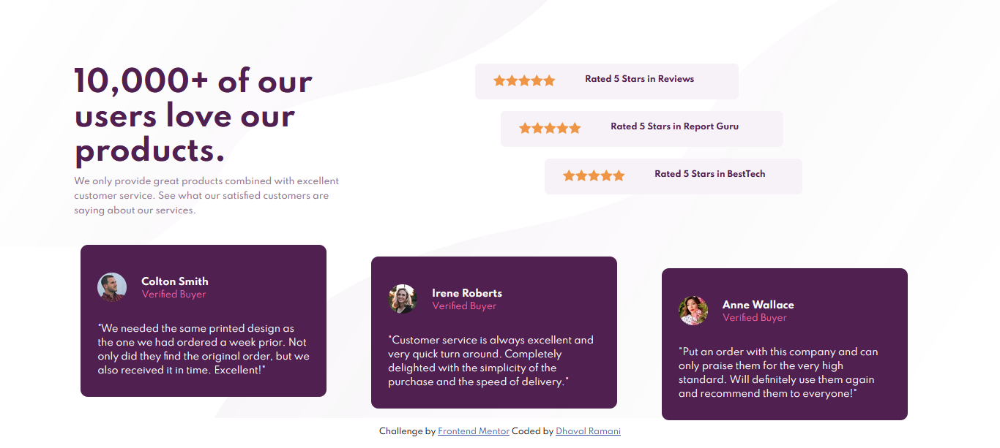

# Frontend Mentor - Social proof section

## Welcome! 👋

This is a solution to the [Social proof section challenge on Frontend Mentor](https://www.frontendmentor.io/challenges/social-proof-section-6e0qTv_bA). Frontend Mentor challenges help you improve your coding skills by building realistic projects. 

## Table of contents

- [Overview](#overview)
  - [The challenge](#the-challenge)
  - [Screenshot](#screenshot)
  - [Links](#links)
  - [Built with](#built-with)
  - [Author](#author)

## Overview

### The challenge

Your challenge is to build out this social proof section and get it looking as close to the design as possible.

You can use any tools you like to help you complete the challenge. So if you've got something you'd like to practice, feel free to give it a go.
### Screenshot

### Links

- Solution URL: [solution](https://www.frontendmentor.io/solutions/social-proof-section-YKWwnVYLA )
- Live Site URL: [live site](https://social-card-proof-section.netlify.app/)

### Built with

- Semantic HTML5 markup
- CSS custom properties
- Flexbox
- CSS Grid

## Author

- Frontend Mentor - [@d4rkh0rse](https://www.frontendmentor.io/profile/d4rkh0rse)
- Twitter - [@Dkdhavalpatel](https://www.twitter.com/Dkdhavalpatel)
